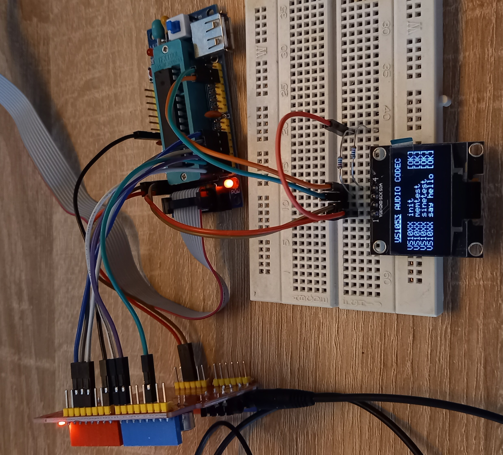

# Library for VS10XX (VS1053)
The main aim was create library to initialize of codec vs1053 with simple sound test - say 'hello' with atmega microcontroller.

## VS10XX Description
Detailed information are described in [Datasheet VS1053](https://www.vlsi.fi/fileadmin/datasheets/vs1053.pdf), [Application Notes VS10XX](https://www.vlsi.fi/fileadmin/app_notes/vs10XXan.pdf).

## Library
C library is determined for controlling [Ogg Vorbis/MP3/AAC/WMA/FLAC/MIDI AUDIO CODEC](https://www.vlsi.fi/fileadmin/datasheets/vs1053.pdf) using 7 pin SPI Bus. It contains only primitive functions for testing purposes

## Hardware connection
| PIN VS10XX | PIN ATMEGA328P | Description |
| :---: | :---: |  :---: |
| 5V | 5V | Supply Voltage |
| AGND | GND | Ground |
| SCLK | PB5 | Clock for serial bus |
| MISO | PB4 | Master IN slave OUT |
| MOSI | PB3 | Master OUT slave IN |
| XCS | PB2 | Chip select input |
| DREQ | PB1 | Data request, input bus |
| XDCS | PB0 | Data chip select |
| XRST | PD7 | Reset |

### Usage
Prior defined for MCU Atmega328p with VS1053 breakboard.

### Tested
Library was tested and proved on a **_VS1053 Breakboard_** with **_Atmega328p_**.
  
## Init sequence
Init sequence (according to [source code documentation](https://www.vlsi.fi/player_vs1011_1002_1003/modularplayer/vs10xx_8c.html#a3)):
```
// +---------------------------------------------+
// |           INIT VS10XX MP3 DECODER           |
// +---------------------------------------------+
//                        |
// +---------------------------------------------+
// |            PORTs / PINs SETTINGS            |
// |---------------------------------------------|
// | OUTPUTs: VS10XX_MOSI, VS10XX_SCK, VS10XX_SS |
// |          VS10XX_XDCS, VS10XX_XRST           |
// |  INPUTs: VS10XX_MISO, VS10XX_DREQ (pullup)  |
// +---------------------------------------------+
//                        |
// +---------------------------------------------+ 
// |      SPI SLOW SPEED INIT / F = 62500Hz      |
// |---------------------------------------------|
// |     SPCR <= SET (SPE, MSTR, SPR1, SPR0)     |
// +---------------------------------------------+
//                        |
// +---------------------------------------------+ 
// |                    RESET                    |
// -----------------------------------------------
// |          activate RESET (low level)         |
// |        wait 22000 clk cycle (1.8 ms)        |
// |             send SPI dummy byte             |
// |      deactivate XCS, XDCS (high level)      |
// |         deactivate RESET (high level)       |
// | activate analog powerdown mode (VOL=0xffff) |
// |    set clock, mul, add => (CLOCKF=0x8800)   |
// |              wait for DREQ high             |
// |    slow sample rate 10 Hz (AUDATA=0x000A)   |
// |                 wait 100ms                  |
// |      turn on analog parts (VOL=0xfefe)      |
// |           8kHz mono (AUDATA=0x1F41)         |
// |     set volume, for exmaple (VOL=0x6666)    |
// +---------------------------------------------+
//                        |
// +---------------------------------------------+ 
// |                 SOFT RESET                  |
// -----------------------------------------------
// |  native SPI modes,soft reset (MODE=0x0804)  |
// |                  wait 1ms                   |
// |              wait for DREQ high             |
// |    set clock, mul, add => (CLOCKF=0x8800)   |
// |                  wait 1ms                   |
// |              wait for DREQ high             |
// |       activate data (XDCS low level)        |
// |         send data four times 0x00           |
// |      deactivate data (XDCS high level)      |
// +---------------------------------------------+
//                        |
// +---------------------------------------------+ 
// |      SPI FAST SPEED INIT / F = 1 MHz        |
// -----------------------------------------------
// |            SPSR <= SET (SPI2X)              |
// |       SPCR <= SET (SPE, MSTR, SPR0)         |
// +---------------------------------------------+
```

## Test Functions
- [VS1053_TestSci (void)](#) - sound test of sending command
- [VS1053_TestSine (uint8_t)](#) - sound test of sine wave with specific frequency
- [VS1053_TestMemory (void)](#) - memory test of particular sections ROM, RAM
- [VS1053_TestSample (const char*, uint16_t)](#) - sound test of saying 'hello'

## Demonstration version v1.0.0


## Links
- [Datasheet VS1003](https://www.vlsi.fi/fileadmin/datasheets/vs1003.pdf)
- [Datasheet VS1053](https://www.vlsi.fi/fileadmin/datasheets/vs1053.pdf)
- [Application Notes VS10XX](https://www.vlsi.fi/fileadmin/app_notes/vs10XXan.pdf)
- [VLSI Solution Oy Evaluation MP3 Player Source Code Documentation](https://www.vlsi.fi/player_vs1011_1002_1003/modularplayer/files.html)

## Acknowledgement
- [Adafruit VS1053 Library](https://github.com/adafruit/Adafruit_VS1053_Library)
- [Vassilis Serasidis](https://os.mbed.com/users/silis/code/VS1053//file/5ad25d480d5f/VS1053.cpp/)
- [baldram](https://github.com/baldram/ESP_VS1053_Library)
